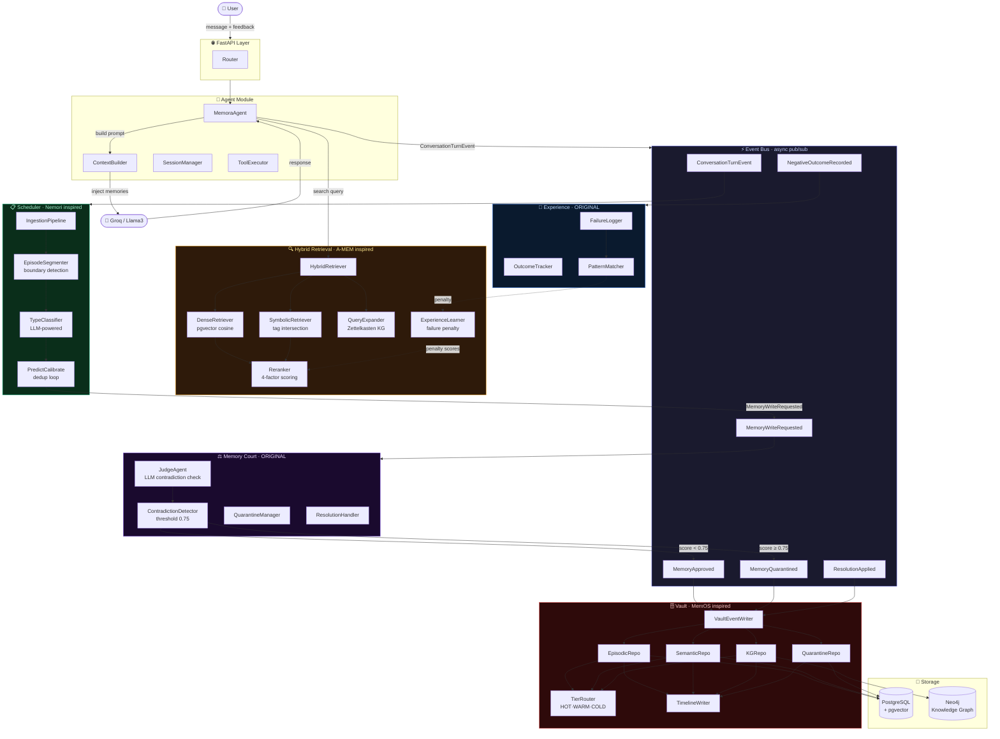
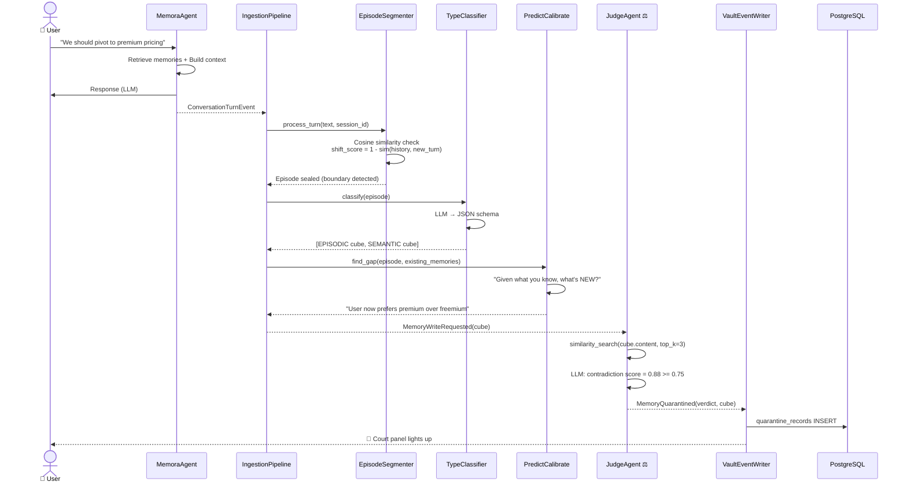
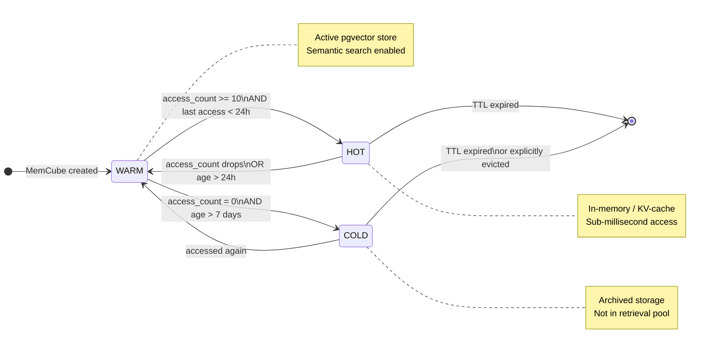
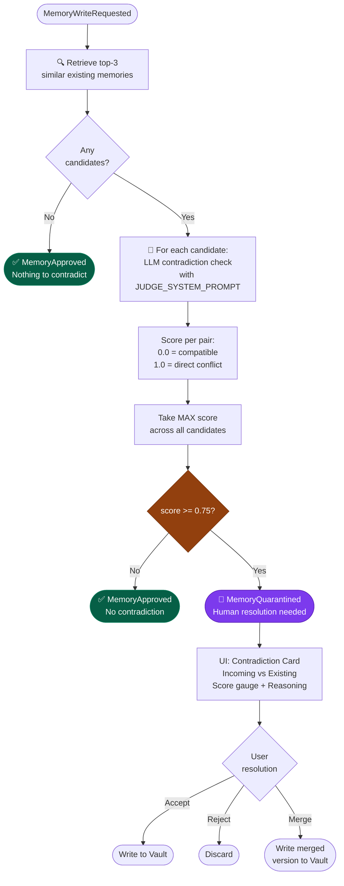
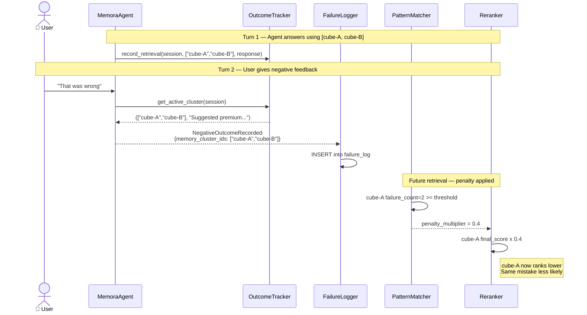
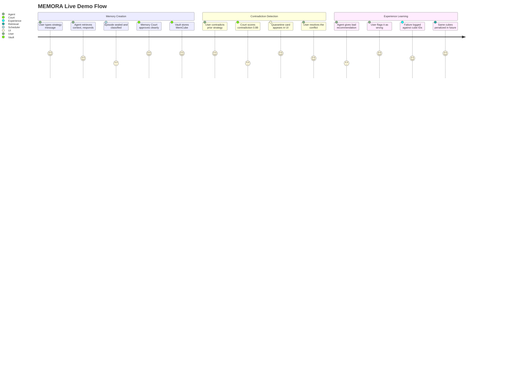

<div align="center">

```
███╗   ███╗███████╗███╗   ███╗ ██████╗ ██████╗  █████╗
████╗ ████║██╔════╝████╗ ████║██╔═══██╗██╔══██╗██╔══██╗
██╔████╔██║█████╗  ██╔████╔██║██║   ██║██████╔╝███████║
██║╚██╔╝██║██╔══╝  ██║╚██╔╝██║██║   ██║██╔══██╗██╔══██║
██║ ╚═╝ ██║███████╗██║ ╚═╝ ██║╚██████╔╝██║  ██║██║  ██║
╚═╝     ╚═╝╚══════╝╚═╝     ╚═╝ ╚═════╝ ╚═╝  ╚═╝╚═╝  ╚═╝
```

### *Persistent Memory Operating System for Long-Running AI Agents*

<br/>

[](tests/)
[](tests/)
[](https://python.org)
[](https://fastapi.tiangolo.com)
[](https://groq.com)
[](LICENSE)

<br/>

> **"Most AI systems today are brilliant — and amnesiac.**
> **Every session starts from zero. MEMORA ends that."**

<br/>

[**⚡ Quick Start**](#-quick-start) · [**🏗 Architecture**](#-architecture) · [**⚖️ Memory Court**](#️-memory-court--our-original-contribution) · [**🧠 Experience Learner**](#-experience-learner--our-original-contribution) · [**🎬 Demo**](#-the-demo-scenario) · [**👥 Team**](#-team)

</div>

---

## 🔥 The Problem — What's Actually Broken

<table>
<tr>
<td width="50%">

**What users experience:**
```
Session 1:  "I prefer low-cost B2B targeting"
Session 2:  Agent has no idea
Session 3:  Agent recommends premium pricing
Session 4:  Same mistake. Again.
```

</td>
<td width="50%">

**What's missing:**
- ❌ No memory across sessions
- ❌ Contradictions stored silently
- ❌ No distinction: facts vs experiences
- ❌ Failures never inform future answers
- ❌ Stale information never evicted

</td>
</tr>
</table>

Memory isn't a feature you bolt on. It's a **system** — with structure, lifecycle, validation, and the ability to learn from its own mistakes.

---

## 🏗 Architecture

### The Full System at a Glance



---

### The Write Path — How a Memory Gets Born



---

### The Retrieval Path — How a Memory Comes Back

```mermaid
flowchart LR
    Q([🔍 Query]) --> QE

    subgraph EXPAND["Query Expansion · Zettelkasten"]
        QE[Extract tags\nfrom query] --> KGS[KG neighbor\nlookup]
        KGS --> ET[Expanded\ntag set]
    end

    ET --> DR & SR

    subgraph DENSE["Dense Search · pgvector"]
        DR[Embed query\n384-dim] --> CS[Cosine similarity\n<=> operator]
        CS --> DR2[Top-K results\nwith scores]
    end

    subgraph SYM["Symbolic Search · PostgreSQL"]
        SR[tags @> query_tags\nJSONB containment] --> SR2[Tag-matched\ncubes]
    end

    DR2 & SR2 --> MERGE[Deduplicate\nby cube.id]

    MERGE --> RR

    subgraph RERANK["Reranking · 4-Factor Score"]
        RR[Base score\n0.7 x dense + 0.3 x symbolic]
        RR --> RC[x recency decay\n1 / 1+days_since_update]
        RC --> FP[x failure penalty\n0.4 if count >= 2]
        FP --> FINAL[Final ranked\nlist]
    end

    FINAL --> CP

    subgraph PAGER["Context Pager · MemGPT FIFO"]
        CP[Priority queue\n0.6 x score + 0.4 x recency]
        CP --> BUD{Budget\n8000 tokens}
        BUD -->|overflow| EV[Evict lowest\npriority]
        BUD -->|ok| INJ[Inject into\nLLM context]
    end

    style EXPAND fill:#0f2,color:#000,stroke:#0a0
    style DENSE fill:#02f,color:#fff,stroke:#00a
    style SYM fill:#f80,color:#000,stroke:#a50
    style RERANK fill:#80f,color:#fff,stroke:#50a
    style PAGER fill:#f08,color:#fff,stroke:#a05
```



---

### Tier Routing — The Memory Lifecycle



---

## ⚖️ Memory Court — *Our Original Contribution*

> **The single most important innovation in MEMORA.**
> No equivalent exists in MemGPT, MemOS, Nemori, or A-MEM.

Before **any** memory enters the vault, it faces the Court.



### The Judge Prompt That Powers It

```python
JUDGE_SYSTEM_PROMPT = """
You are the Memory Court Judge for an AI agent's long-term memory.

A CONTRADICTION is when two memories cannot both be true simultaneously.
Example: "Project uses low-cost pricing" vs "Project uses premium pricing"

Score guide:
  0.0-0.3  -> Compatible or unrelated
  0.3-0.6  -> Mild tension, context-dependent
  0.6-0.75 -> Significant conflict
  0.75-1.0 -> Direct contradiction  <-- QUARANTINE THRESHOLD

Respond ONLY with valid JSON:
{
  "contradiction_score": <float 0.0-1.0>,
  "reasoning": "<explanation>",
  "suggested_resolution": "accept" | "reject" | "merge: <merged text>"
}
"""
```

### Live Court Example

```
┌─────────────────────────────────────────────────────────────┐
│  ⚖️  MEMORY COURT          Score: ████████░░  0.88          │
├───────────────────────────┬─────────────────────────────────┤
│  INCOMING                 │  CONFLICTS WITH                 │
│  "We should pivot to      │  "Pricing model: freemium       │
│   premium enterprise      │   with $29/month pro tier"      │
│   pricing strategy"       │                                 │
├───────────────────────────┴─────────────────────────────────┤
│  Reasoning: Both memories make conflicting claims about     │
│  pricing strategy. One states freemium, other says premium. │
│  These cannot coexist.                                      │
├─────────────────────────────────────────────────────────────┤
│  Suggestion: reject                                         │
│  [ ✓ Accept ]  [ ✗ Reject ]  [ ⟳ Merge... ]               │
└─────────────────────────────────────────────────────────────┘
```

**Critical design invariant:**
```
Court NEVER writes to DB.
Court ONLY emits events.
Vault listens. Vault writes.
```

---

## 🧠 Experience Learner — *Our Original Contribution*

> *"The agent that burns its hand remembers not to touch the stove."*



### The Penalty Math

```python
# Without failure history:
final_score = 0.7 * dense_score + 0.3 * symbolic_hit
            = 0.7 * 0.90 + 0.3 * 1.0
            = 0.93   # <-- cube-A would be #1 ranked

# With 2+ failures logged against cube-A:
final_score = 0.93 * recency_decay * failure_penalty
            = 0.93 * 0.95 * 0.40
            = 0.35   # <-- cube-A now ranks much lower

# Rule: 1 failure = fluke (no penalty)
#       2+ failures = pattern (penalty = 0.4x multiplier)
```

---

## 🧱 The MemCube — Everything Is Typed

```python
@dataclass
class MemCube:
    id: str                          # UUID4 — auto-generated
    content: str                     # The memory text (non-empty enforced)
    memory_type: MemoryType          # EPISODIC | SEMANTIC | KG_NODE
    tier: MemoryTier                 # HOT | WARM | COLD
    tags: list[str]                  # For symbolic retrieval
    embedding: list[float]           # 384-dim, all-MiniLM-L6-v2, unit-normalized
    provenance: Provenance           # Origin, session, version, parent_id, timestamps
    access_count: int                # Incremented on every retrieval
    ttl_seconds: Optional[int]       # None = immortal
    extra: dict[str, Any]            # KG edge labels, semantic keys, etc.
```

Three types. Three purposes. Zero ambiguity:

| Type | Stores | Example | Retrieval Role |
|---|---|---|---|
| `EPISODIC` | What happened | *"On Tuesday we discussed B2B pricing with Sarah"* | Narrative context |
| `SEMANTIC` | Distilled facts | *"User prefers low-cost B2B model"* | Fact injection |
| `KG_NODE` | Graph entity | *"Acme Corp → targets → SMB segment"* | Relationship traversal |

---

## 📡 The Event Bus — Zero Coupling

Every module communicates through typed events. Nothing imports anything for side effects.

```python
# The complete system wiring — 6 lines, entire MEMORA
bus.subscribe(ConversationTurnEvent,   ingestion_pipeline.handle)
bus.subscribe(MemoryWriteRequested,    judge_agent.handle)          # Court
bus.subscribe(MemoryApproved,          vault_writer.handle_approved)
bus.subscribe(MemoryQuarantined,       vault_writer.handle_quarantined)
bus.subscribe(ResolutionApplied,       vault_writer.handle_resolution)
bus.subscribe(NegativeOutcomeRecorded, failure_logger.handle)       # Experience
```

**What this means:**
- Scheduler doesn't know Court exists
- Court doesn't know Vault exists  
- Every module is independently testable
- Swap any module without touching others

---

## 🌿 Nemori Episode Segmentation

Raw conversation turns don't map cleanly to memories. MEMORA segments them:

```python
async def is_boundary(self, history: list[str], new_turn: str) -> bool:
    shift_score = 1.0 - cosine_similarity(
        await self.embedder.embed(" ".join(history[-3:])),
        await self.embedder.embed(new_turn)
    )
    # Semantic shift OR buffer overflow → seal current episode, start new one
    return shift_score >= self.threshold or len(history) >= self.buffer_size
```

Then the **Predict-Calibrate loop** prevents redundancy before writing:

```
Existing: "User prefers low-cost B2B model"
New turn: "User mentioned they like affordable pricing"

LLM: "What's genuinely NEW here?"
→ "NO_NEW_INFORMATION"
→ Semantic cube creation SKIPPED ✓  (no duplicate stored)
```

---

## 🔬 Hybrid Retrieval — 4 Signals, 1 Ranked Answer

```
Query: "What pricing approach should we use?"
         │
         ▼
┌─────────────────────────────────────────────────┐
│  QueryExpander  (Zettelkasten / A-MEM)          │
│  "pricing" → KG neighbors → ["B2B","strategy"] │
└─────────────────┬───────────────────────────────┘
                  │
    ┌─────────────┴──────────────┐
    ▼                            ▼
DenseRetriever              SymbolicRetriever
pgvector cosine sim         tags @> ["pricing"]
(semantic meaning)          (exact match)
    │                            │
    └────────────┬───────────────┘
                 ▼
           Reranker
    ┌──────────────────────────────┐
    │ 0.7 × dense_score            │
    │ 0.3 × symbolic_hit           │
    │ × recency_decay (1/1+days)   │
    │ × failure_penalty (0.4 if≥2) │
    └──────────────────────────────┘
                 │
                 ▼
        Top-K ranked memories
                 │
                 ▼
         ContextPager  (MemGPT)
    Token budget: 8,000 tokens
    Priority = 0.6×score + 0.4×recency
    Evict lowest priority on overflow
```

---

## 🎬 The Demo Scenario



**Step by step, what judges will see:**

```
Step 1  →  "We're building a low-cost B2B product"
           Memory stored: [SEMANTIC] pricing.model = "freemium / $29/month"
           Knowledge graph node: Acme Corp → strategy → Low-cost B2B

Step 2  →  "Let's pivot to premium enterprise pricing"
           ⚖️  Court fires. Score: 0.88. QUARANTINED.
           UI: Contradiction card appears: [ Accept ] [ Reject ] [ Merge ]

Step 3  →  User clicks Accept
           ResolutionApplied → Vault writes approved memory
           Timeline panel: "resolved" event appears
           D3 graph: new node animated into knowledge graph

Step 4  →  "What pricing approach failed before?"
           🧠 Experience Learner surfaces failure patterns
           Reranker penalizes premium-related memories
           Agent: "The premium approach was previously flagged..."
```

---

## ⚡ Quick Start

```bash
# 1. Clone and setup
git clone https://github.com/your-org/memora && cd memora
cp .env.example .env
# → Add GROQ_API_KEY=gsk_... to .env

# 2. Infrastructure
docker-compose up -d          # postgres+pgvector · neo4j · redis

# 3. Install
poetry install

# 4. Database
make migrate                  # Alembic: 4 tables + pgvector extension
make seed                     # 8 demo memories + 1 pre-seeded contradiction

# 5. Run
make dev                      # Backend  → http://localhost:8000
make frontend                 # Dashboard → http://localhost:5173
```

**Verify:**
```bash
make test-unit
# 88 tests, no Docker, ~1.4s, 0 failures

curl localhost:8000/health
# {"status":"ok","total_memories":8,"quarantine_pending":1}
```

---

## 🧪 Test Suite

```
━━━━━━━━━━━━━━━━━━━━━━━━━━━━━━━━━━━━━━━━━━━━━━━━━━━
  105 tests · 0 failures · 0 warnings · 1.78s
━━━━━━━━━━━━━━━━━━━━━━━━━━━━━━━━━━━━━━━━━━━━━━━━━━━

  tests/unit/test_contradiction_detector.py  ✓ 11
  tests/unit/test_mem_cube.py                ✓ 24
  tests/unit/test_tier_router.py             ✓ 19
  tests/unit/test_hybrid_retriever.py        ✓  9
  tests/unit/test_episode_segmenter.py       ✓  3
  tests/unit/test_experience_learner.py      ✓  5
  tests/integration/test_court_to_vault.py   ✓  7
  tests/integration/test_agent_conversation  ✓  5
  tests/integration/test_ingestion_pipeline  ✓  5
  tests/test_core_basic.py                   ✓ 17
━━━━━━━━━━━━━━━━━━━━━━━━━━━━━━━━━━━━━━━━━━━━━━━━━━━
```

Every module testable in isolation. No real DB, no real LLM, no real embedder needed in unit tests — 100% mock-driven via `conftest.py` fixtures with typed interfaces.

---

## 🗂 Repository Structure

```
memora/
│
├── memora/                    # Main Python package
│   ├── core/                  # ★ Zero dependencies — pure domain
│   │   ├── types.py           # MemCube, Episode, ContradictionVerdict
│   │   ├── events.py          # EventBus + all typed events
│   │   ├── interfaces.py      # Abstract ports (ILLM, IRetriever, ...)
│   │   ├── errors.py          # Domain exceptions → HTTP status codes
│   │   └── config.py          # Pydantic Settings (all env vars)
│   │
│   ├── storage/               # Raw DB drivers. Zero business logic.
│   │   ├── postgres/          # SQLAlchemy models + Alembic migrations
│   │   ├── vector/            # pgvector client + sentence-transformers
│   │   └── graph/             # Neo4j (prod) + NetworkX (demo fallback)
│   │
│   ├── vault/                 # MemCube persistence + tier routing
│   │   ├── mem_cube.py        # MemCubeFactory — the birthplace of memories
│   │   ├── episodic_repo.py   # CRUD for narrative memories
│   │   ├── semantic_repo.py   # CRUD for distilled facts
│   │   ├── kg_repo.py         # Knowledge graph nodes + versioned edges
│   │   ├── quarantine_repo.py # Court's holding pen
│   │   ├── tier_router.py     # HOT/WARM/COLD routing logic (pure)
│   │   ├── provenance.py      # Version chains + timestamps
│   │   ├── ttl_manager.py     # Background eviction cycles
│   │   ├── timeline_writer.py # Audit trail for every vault operation
│   │   └── vault_event_writer.py # Event bus → vault bridge
│   │
│   ├── llm/                   # LLM provider abstraction
│   │   ├── groq_client.py     # GroqClient (retry + JSON-mode)
│   │   ├── openai_client.py   # OpenAI fallback
│   │   └── prompts/           # JUDGE_SYSTEM_PROMPT + CLASSIFIER_SYSTEM_PROMPT
│   │
│   ├── scheduler/             # Conversation → MemCubes  [Nemori]
│   │   ├── boundary_detector.py   # Cosine shift → episode split
│   │   ├── episode_segmenter.py   # Buffer + boundary management
│   │   ├── type_classifier.py     # LLM: episodic vs semantic
│   │   ├── predict_calibrate.py   # Deduplication before write
│   │   └── ingestion_pipeline.py  # Full write path orchestrator
│   │
│   ├── retrieval/             # Read-only. Stateless. Never writes.  [A-MEM]
│   │   ├── hybrid_retriever.py    # Main IRetriever implementation
│   │   ├── dense_retriever.py     # pgvector cosine search
│   │   ├── symbolic_retriever.py  # Tag intersection queries
│   │   ├── query_expander.py      # Zettelkasten KG expansion
│   │   ├── reranker.py            # 4-factor score fusion
│   │   ├── context_pager.py       # MemGPT FIFO token budget
│   │   └── experience_learner.py  # Failure penalty reader
│   │
│   ├── court/                 # ⚖️ ORIGINAL — Memory Court
│   │   ├── contradiction_detector.py  # Pure scoring logic (no I/O)
│   │   ├── judge_agent.py             # Event subscriber + verdict publisher
│   │   ├── quarantine_manager.py      # Read-side queue view
│   │   └── resolution_handler.py      # User resolution → event
│   │
│   ├── experience/            # 🧠 ORIGINAL — Failure loop
│   │   ├── failure_logger.py  # DB write on NegativeOutcomeRecorded
│   │   ├── outcome_tracker.py # In-memory blame trail per session
│   │   └── pattern_matcher.py # Overlap detection + penalty calc
│   │
│   ├── agent/                 # Conversational orchestrator
│   │   ├── memora_agent.py    # 7-step turn loop
│   │   ├── context_builder.py # Memory injection into LLM prompt
│   │   ├── session_manager.py # Turn count + token tracking
│   │   └── tool_executor.py   # Agent-callable memory tools
│   │
│   └── api/                   # FastAPI — thin HTTP wrapper only
│       ├── app.py             # Lifespan wiring of all components
│       ├── routers/           # chat · memories · court · graph · timeline · health
│       └── schemas/           # Pydantic request/response models
│
├── frontend/                  # React + D3 + Tailwind dashboard
│   └── src/
│       ├── components/
│       │   ├── graph/         # D3 force-directed knowledge graph
│       │   ├── court/         # Live contradiction queue + resolve UI
│       │   ├── timeline/      # Memory event timeline
│       │   ├── chat/          # Conversation + memory badges
│       │   └── health/        # System metrics panel
│       ├── hooks/             # useCourtQueue · useGraphData · useHealth
│       └── store/             # Zustand: chat · court · ui state
│
├── specs/                     # 14 binding TDD specification documents
├── tests/                     # 105 tests: unit + integration + e2e
├── scripts/                   # seed_demo_data · run_locomo_eval · export_graph
└── docker-compose.yml         # postgres+pgvector · neo4j · redis
```

---

## 📊 Research Attribution

| Paper Concept | Source | Our Implementation |
|---|---|---|
| Hierarchical memory tiers | [MemGPT](https://arxiv.org/abs/2310.08560) (Packer et al., 2023) | `vault/tier_router.py` · `retrieval/context_pager.py` |
| MemCube + provenance tagging | [MemOS](https://github.com/MemTensor/MemOS) (2025) | `vault/mem_cube.py` · `vault/provenance.py` |
| Episode boundary detection | [Nemori](https://github.com/Shichun-Liu/Agent-Memory-Paper-List) (2025) | `scheduler/episode_segmenter.py` · `boundary_detector.py` |
| Predict-calibrate loop | [Nemori](https://github.com/Shichun-Liu/Agent-Memory-Paper-List) (2025) | `scheduler/predict_calibrate.py` |
| Zettelkasten memory linking | [A-MEM](https://github.com/agiresearch/A-mem) (Xu et al., 2025) | `retrieval/query_expander.py` · `vault/kg_repo.py` |
| Hybrid dense + symbolic search | [A-MEM](https://github.com/agiresearch/A-mem) (Xu et al., 2025) | `retrieval/hybrid_retriever.py` |
| **Memory Court** ⚖️ | **Original** | `court/` — entire module, no equivalent in any paper |
| **Experience Learner** 🧠 | **Original** | `experience/` · `retrieval/reranker.py` |

---

## 🆚 MEMORA vs The Field

| Capability | Vanilla RAG | MemGPT | Mem0 | **MEMORA** |
|---|---|---|---|---|
| Cross-session memory | ❌ | ✅ | ✅ | ✅ |
| Typed memory (episodic / semantic) | ❌ | ❌ | ❌ | ✅ |
| Write-time contradiction check | ❌ | ❌ | ❌ | ✅ **Original** |
| Human-in-loop resolution UI | ❌ | ❌ | ❌ | ✅ **Original** |
| Failure-aware retrieval penalty | ❌ | ❌ | ❌ | ✅ **Original** |
| Knowledge graph + versioned edges | ❌ | ❌ | Partial | ✅ |
| Tiered storage (HOT / WARM / COLD) | ❌ | ✅ | ❌ | ✅ |
| Episode boundary detection | ❌ | ❌ | ❌ | ✅ |
| Predict-calibrate deduplication | ❌ | ❌ | ❌ | ✅ |
| Fully event-driven, decoupled | ❌ | ❌ | ❌ | ✅ |

---

## 🛠 Tech Stack

<table>
<tr><td><b>Backend</b></td><td>Python 3.11 · FastAPI · SQLAlchemy async · Alembic</td></tr>
<tr><td><b>LLM</b></td><td>Groq API / Llama3-70b · exponential backoff · JSON-mode</td></tr>
<tr><td><b>Embeddings</b></td><td>sentence-transformers · all-MiniLM-L6-v2 · 384-dim · unit-normalized</td></tr>
<tr><td><b>Vector DB</b></td><td>PostgreSQL + pgvector · IVFFlat cosine index</td></tr>
<tr><td><b>Graph DB</b></td><td>Neo4j (production) · NetworkX in-memory (demo / offline)</td></tr>
<tr><td><b>Frontend</b></td><td>React 18 · D3.js force graph · Tailwind CSS · Zustand · React Query</td></tr>
<tr><td><b>Testing</b></td><td>pytest · pytest-asyncio strict mode · 105 tests · mock-driven unit isolation</td></tr>
</table>

---

## 👥 Team

<table>
<tr>
<td align="center" width="25%">
<b>Gaurav Mishra</b><br/>
<i>Foundation</i><br/><br/>
<code>core/</code> <code>storage/</code> <code>vault/</code><br/><br/>
Domain types · pgvector storage · MemCube factory · Three-tier routing · Provenance system · Migration scripts
</td>
<td align="center" width="25%">
<b>Arnav Singh</b><br/>
<i>Intelligence Pipeline</i><br/><br/>
<code>scheduler/</code> <code>llm/</code> <code>retrieval/</code><br/><br/>
Nemori episode segmentation · Predict-calibrate dedup · Hybrid retrieval · Groq integration · Reranker
</td>
<td align="center" width="25%">
<b>Avinash Singh Pal</b><br/>
<i>Decision Loop</i><br/><br/>
<code>court/</code> <code>experience/</code> <code>agent/</code><br/><br/>
Memory Court ⚖️ · Contradiction detection · Experience Learner 🧠 · MemoraAgent turn loop · Session management
</td>
<td align="center" width="25%">
<b>Lavish</b><br/>
<i>Interface Layer</i><br/><br/>
<code>api/</code> <code>frontend/</code><br/><br/>
FastAPI wiring · D3 knowledge graph · Court resolution UI · Memory timeline · Health dashboard · Demo seeding
</td>
</tr>
</table>

---

<div align="center">

**Built at the MEMORA Hackathon · April 2026**

<br/>

*Not just remembering more.*
*Remembering **correctly**.*
*An AI that genuinely improves over time.*

<br/>

---

```
"The palest ink is better than the best memory."
                               — Chinese Proverb

MEMORA gives AI the ink.
```

</div>
